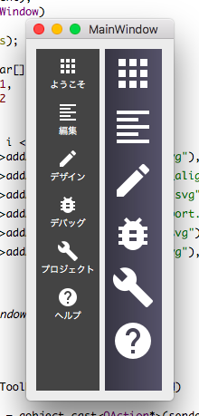

# QToolbar カスタムスタイルサンプル

Qt で QToolbar をスタイルシートにより見た目をカスタマイズするサンプルソースです。

[じゅげむったーの開発日記 その４](http://www.sharkpp.net/blog/2017/06/27/jugemutter-development-diary-4th.html) で利用されています。

## ライセンス

© 2017 sharkpp

このサンプルソースは [MIT ライセンス](LICENSE.ja-JP) の下で提供されています。

また、 [Material icons - Material Design](https://material.io/icons/) は [Apache License Version 2.0](./material_icons/LICENSE) の下で提供されています。
